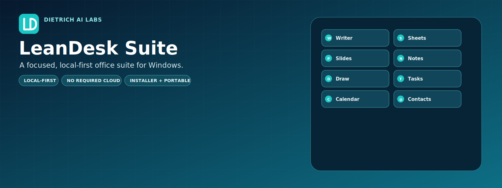

<p align="center">
  
</p>

<h1 align="center">LeanDesk Suite 0.7.0</h1>

<p align="center">
  A lightweight, local-first Windows productivity suite from Dietrich AI Labs.
</p>

<p align="center">
  
  
  
  
</p>

LeanDesk Suite brings eight everyday tools into one focused desktop workspace. Normal operation does not require an online account or cloud service.

## What is included

| App | Purpose |
| --- | --- |
| **Writer** | Create and edit documents. |
| **Sheets** | Work with spreadsheets and structured data. |
| **Slides** | Build and present slide decks. |
| **Notes** | Capture quick notes and ideas. |
| **Draw** | Create drawings and visual layouts. |
| **Tasks** | Organize tasks and priorities. |
| **Calendar** | Plan dates and schedules. |
| **Contacts** | Keep contact information organized. |

## Download and install

Official installer and portable packages are published on the [GitHub Releases page](https://github.com/dietrichailabs-oss/LeanDesk-Suite/releases).

### Installer package

1. Download and extract the installer ZIP.
2. Run `LeanDesk_Suite_Setup_0.7.0.exe`.
3. Follow the setup wizard.

### Portable package

1. Download and completely extract the portable ZIP.
2. Open the extracted `LeanDesk_Suite` folder.
3. Run `LeanDesk_Suite.exe`.

> [!IMPORTANT]
> Do not run LeanDesk Suite directly from inside a ZIP archive.

## Help and support

Having trouble? Use this support path so the project team can investigate efficiently:

1. Confirm that the ZIP was fully extracted and that you are using the newest available release.
2. Review the documentation included with the downloaded package.
3. Search the [existing issues](https://github.com/dietrichailabs-oss/LeanDesk-Suite/issues) for the same problem.
4. If the issue is new, [open a GitHub issue](https://github.com/dietrichailabs-oss/LeanDesk-Suite/issues/new) with:
   - the LeanDesk Suite version and build;
   - the package type used: installer or portable;
   - the Windows version;
   - the smallest reproducible steps;
   - the expected and actual result.

Before sharing a screenshot, log, or sample file, remove personal information, credentials, customer data, and confidential content. Do not submit an original private document. Use a minimal, redacted example only when it is necessary to reproduce the issue.

## Local data and privacy

LeanDesk stores settings, recent-file history, organizer data, recovery copies, backups, templates, imported slide assets, preserved damaged-data copies, and short-lived print-temporary files locally under:

```text
%LOCALAPPDATA%\Dietrich AI Labs\LeanDesk Suite
```

Print-temporary files use unpredictable names, are scheduled for delayed deletion, and stale leftovers are removed during a later startup.

LeanDesk does not require an online account or cloud service for normal operation.

## Unsigned Windows release

This release is intentionally unsigned because no publicly trusted Authenticode certificate was supplied. Windows may display an **Unknown Publisher** or **Microsoft Defender SmartScreen** warning.

Verify downloaded artifacts against the published SHA-256 values before running them. Only download LeanDesk Suite from the official Dietrich AI Labs GitHub repository and its Releases page.

## Release integrity and included documentation

Each public distribution exposes `SOURCE_TREE_ID.txt` beside this README and includes the release documentation required for that package, including:

- `LICENSE.txt`
- `EULA.txt`
- `THIRD_PARTY_NOTICES.txt`
- `SIGNING_POLICY.md`
- `CHANGELOG.md`

Application source, current QA evidence, historical evidence, and internal build records are maintained separately from the public runtime packages. This separation keeps release downloads focused and prevents development artifacts from being shipped accidentally.

## About the project

LeanDesk Suite is part of the Dietrich AI Labs software portfolio: practical tools built with an emphasis on local operation, clear release boundaries, and user-controlled files.
