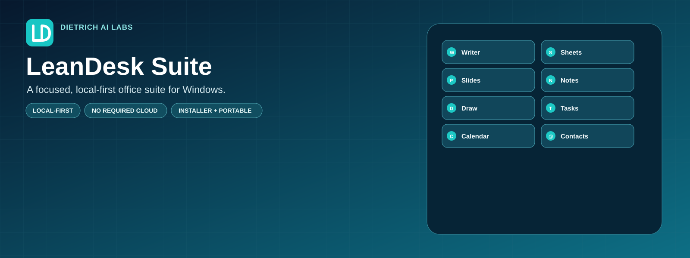

<p align="center">
  
</p>

<h1 align="center">LeanDesk Suite 0.8.0</h1>

<p align="center">
  A focused, local-first Windows productivity suite from Dietrich AI Labs.
</p>

<p align="center">
  
  
  
  
</p>

LeanDesk Suite brings Writer, Sheets, Slides, Notes, Draw, Tasks, Calendar, and Contacts into one Windows desktop workspace. Normal operation does not require an online account or cloud service.

## Official download

- [Download LeanDesk Suite 0.8.0 from Dietrich AI Labs](https://downloads.dietrichailabs.com/LeanDesk_Suite_0.8.0.zip)
- [Browse GitHub Releases](https://github.com/dietrichailabs-oss/LeanDesk-Suite/releases)
- File: `LeanDesk_Suite_0.8.0.zip`
- Size: `85,645,756 bytes`
- SHA-256: `A943C7B4CC743836139DDEFF8B4EB670264ECBC2329256F5B5FB853AE8FFA16A`

Verify the complete SHA-256 before opening or extracting the package. Do not run LeanDesk directly from inside the ZIP archive.

## Package layout

- `LeanDesk_Suite_Setup_0.8.0.exe` — recommended Windows installer
- `LeanDesk_Suite.exe` — standalone portable executable
- `Documentation/` — changelog, license, EULA, third-party notices, and version record
- `Verification/` — public signing certificate, signature report, and release provenance
- `SHA256SUMS.txt` — SHA-256 hashes for every distributed file

## Included tools

| Tool | Purpose |
| --- | --- |
| **Writer** | Text documents, Markdown, HTML, basic DOCX/RTF import, and PDF export |
| **Sheets** | CSV, native workbooks, formulas, and bounded XLSX import/export |
| **Slides** | Native presentations and focused PPTX import/export |
| **Notes** | Markdown notes, notebooks, tags, search, and local saving |
| **Draw** | Lightweight diagrams with SVG and PNG export |
| **Tasks** | Local task and priority management |
| **Calendar** | Local dates and scheduling |
| **Contacts** | Local contact organization |

Office and OpenDocument compatibility is practical and bounded. Complex layouts, macros, embedded objects, tracked changes, advanced formulas, animations, and exact formatting may not round-trip. Review exported files before relying on them for critical work.

## Install

1. Download and completely extract `LeanDesk_Suite_0.8.0.zip`.
2. Run `LeanDesk_Suite_Setup_0.8.0.exe`.
3. Follow the installer prompts.
4. Launch LeanDesk Suite from the Start menu.

The installer registers supported formats under Windows **Open with** without silently replacing existing default applications. Native LeanDesk file associations are optional.

## Portable use

Completely extract the release ZIP, then run `LeanDesk_Suite.exe`. LeanDesk stores profile data under:

```text
%LOCALAPPDATA%\Dietrich AI Labs\LeanDesk Suite
```

User-created profile data is preserved when the application is uninstalled.

## Updates and privacy

The optional weekly update check reads public update metadata only from:

```text
https://www.dietrichailabs.com/updates/leandesk.json
```

It does not silently download or install software. It sends no document contents, file paths, user name, email address, hardware inventory, usage statistics, device ID, or persistent tracking identifier. The weekly check can be disabled in Settings.

## Signing and Windows warnings

The release binaries use a Dietrich AI Labs self-signed code-signing certificate, not a publicly trusted commercial certificate. Windows may still display **Unknown Publisher** or Microsoft Defender SmartScreen reputation warnings.

The included public certificate and signature report support integrity verification, but they do not make the self-signed certificate publicly trusted. Always verify the published SHA-256.

## Help and support

1. Confirm the ZIP was fully extracted and that you are using version 0.8.0.
2. Review the documentation included in the package.
3. Search [existing issues](https://github.com/dietrichailabs-oss/LeanDesk-Suite/issues).
4. If needed, [open a new issue](https://github.com/dietrichailabs-oss/LeanDesk-Suite/issues/new) with the version, package type, Windows version, reproduction steps, and expected/actual behavior.

Remove personal information, credentials, customer data, and confidential content from screenshots, logs, and sample files before posting publicly.

## Official links

- [LeanDesk product page](https://www.dietrichailabs.com/leandesk.html)
- [Dietrich AI Labs download center](https://www.dietrichailabs.com/downloads.html)
- [Dietrich AI Labs](https://www.dietrichailabs.com)

## Publisher

**Dietrich AI Labs**
