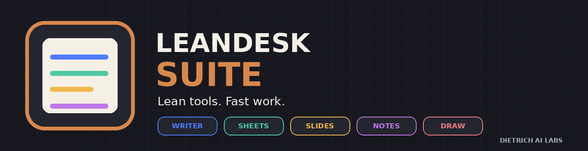

# LeanDesk Suite 0.8.0 — All-Modules Functional Preview

**Lean tools. Fast work.**

LeanDesk Suite is a local-first Windows productivity suite built around the tools people use most, without a required account, cloud service, telemetry, or subscription.

Version 0.8.0 is a reconstructed compatibility candidate in independent-QA correction. Every planned module opens from the same suite shell, but cross-suite import remains best-effort rather than a claim of pixel-perfect Microsoft Office, LibreOffice/OpenOffice, or Apple iWork round trips.

## Included modules

### Writer

- Clean original ribbon with `File`, `Home`, `Insert`, `Layout`, `Review`, `View`, and `Help`
- New, Open, Save, Save As, Export PDF, and Print under the File menu
- Clipboard, Font, Paragraph, Styles, Editing, and Proofing groups
- Clearly slanted italic control
- Line spacing from 1.0 through 3.0, custom spacing, and paragraph spacing
- Offline spell checking with a bundled English dictionary of more than 100,000 words
- Live red-underlined spelling alerts
- Right-click replacement suggestions
- Personal dictionary stored locally
- Native `.ldoc`, TXT, Markdown, HTML, Unicode-safe plain-text RTF, bounded basic DOCX, and PDF export
- Formatting, headings, lists, indentation, alignment, colors, and highlighting
- Find and replace, counts, zoom, autosave recovery, and recent files

### Sheets

- Multiple worksheets
- Editable 200-row by 52-column grids (A1 through AZ200)
- Formula bar and A1 cell addressing
- Arithmetic formulas and cell references
- `SUM`, `AVERAGE`, `MIN`, `MAX`, and `COUNT`
- Native `.lsheet` workbooks
- CSV import/export
- XLSX import/export through OpenPyXL after shared bounded OOXML package preflight
- Add, rename, delete, duplicate-style workflow, and recalculation

### Slides

- Slide list, title, body, speaker notes, and normalized embedded images
- Five built-in visual themes
- Add, duplicate, delete, and reorder slides
- Presenter window with keyboard navigation
- Native `.ldeck` presentation format
- PPTX import/export through python-pptx after shared bounded OOXML package preflight

### Notes

- Local Markdown notes
- Notebooks, tags, search, and pinned notes
- Split editor and formatted preview
- Automatic local saving
- Markdown import/export

### Draw

- Rectangle, ellipse, line, arrow, and text tools
- Selection, movement, color controls, and deletion
- Native `.ldraw` drawing format
- SVG and PNG export

### Personal organizer

- **Tasks:** due dates, priorities, status, projects, notes, search, completion, and local storage
- **Calendar:** month view and local events
- **Contacts:** searchable contact records and notes

## Shared suite foundation

Every module uses one launcher, sidebar, installer, local-data location, recent-file list, theme system, and publisher identity. The Windows installer registers LeanDesk under **Open with** for supported Office, OpenDocument, legacy, iWork, text, and native formats without silently replacing the user’s existing defaults. Native LeanDesk defaults remain an optional installer choice.

## Local data

```text
%LOCALAPPDATA%\Dietrich AI Labs\LeanDesk Suite
```

Settings, recovery records, personal dictionary words, notes, tasks, calendar events, contacts, and recent-file history remain local. Uninstalling preserves user-created data.

## Run from source

```text
RUN_LEANDESK_SUITE.bat
```

The app starts without optional Office-format libraries, but XLSX, PPTX, DOCX, and PDF features require the exact packages in `requirements.lock.txt`. Legacy and foreign-format conversion uses a separately installed trusted LibreOffice/`soffice` executable when required; LibreOffice is not bundled by this source package.

## Build the complete Windows release

```text
BUILD_LEANDESK_SUITE.bat
```

The builder:

- creates an isolated Python environment
- installs the exact dependency lock
- runs the canonical recursive compile/collection/test gate
- regenerates the icon, README banner, and social preview
- builds a one-file Windows preview EXE
- creates or reuses the Dietrich AI Labs self-signing certificate
- signs the application and installer when Windows SignTool is available
- builds one current-user Inno Setup installer
- registers supported formats under Windows **Open with** without stealing existing defaults
- retains optional native LeanDesk default associations
- produces portable, installer, and complete ZIP packages
- writes SHA256 checksums and signature reports


## Updates and privacy

LeanDesk can fetch public update metadata from exactly:

```text
https://www.dietrichailabs.com/updates/leandesk.json
```

Automatic checks are enabled by default but occur only on normal startup and at most once every seven days. **Settings → Check for Updates Now** bypasses the timer, and the weekly preference can be disabled. The checker sends no user name, document information, paths, hardware inventory, email, usage statistics, device ID, or persistent tracking identifier. It never downloads or installs software, never runs as a service, and never blocks offline startup.

## Profile backup and restore

The File and Settings menus expose verified local-profile backup and restore. A backup is built in a same-directory temporary file, flushed, structurally and semantically verified, identity/hash checked, and only then atomically replaces the selected destination; any pre-commit failure leaves an existing backup untouched. Restore rejects linked/reparse/mount-redirection roots, fully validates an isolated staging profile, and rechecks filesystem identities before rename boundaries. The successful staging-to-live directory rename is the restore commit point: failures before it reactivate or retain the previous profile, while cleanup or durability faults after it are reported as successful-restore warnings and never falsely claim that the old profile stayed live.

## Imported-document safety

Foreign and compatibility documents are opened without making the original a writable LeanDesk source. Ordinary **Save** offers to create a separate copy. **Save As** cannot target the original file or an alias to it and cannot write to import-only formats. This protects unsupported objects and formatting from silent destructive round trips.

## Compatibility boundaries

This release is designed for practical testing and iteration. Direct DOCX, XLSX, and PPTX imports are validated from an immutable bounded in-memory package before third-party parsing, with parser-level DTD/entity prohibition and resource budgets. RTF import decodes stateful single- and multibyte ANSI code pages and export preserves plain Unicode text, but neither path claims full formatting round-trip fidelity.

- Complex DOCX layouts, comments, tracked changes, macros, embedded objects, and exact pagination may not round-trip correctly.
- Sheets supports a deliberately small safe formula language, not the complete Excel function catalog.
- PPTX import/export focuses on plain slide text, images, notes, and simple layouts.
- Draw is a lightweight diagram tool, not a full vector-graphics replacement.
- Notes preview supports common lightweight Markdown patterns rather than every extension.

Review exported files before relying on them for critical work.

## Publisher

**Dietrich AI Labs**
