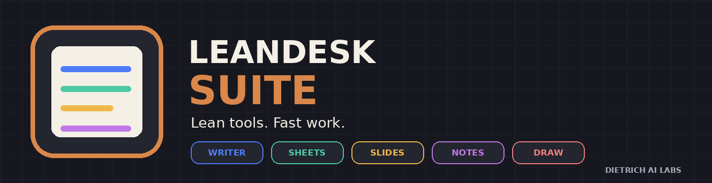

# LeanDesk Suite 0.9.0

**Lean tools. Fast work.**

A local-first Windows productivity suite with Writer, Sheets, Slides, Notes, Draw, Tasks, Calendar, and Contacts. No required account, cloud service, telemetry, or subscription.

## Download the approved release

- [LeanDesk Suite 0.9.0 release and checksums](https://github.com/dietrichailabs-oss/LeanDesk-Suite/releases/tag/v0.9.0)
- [Windows installer](https://github.com/dietrichailabs-oss/LeanDesk-Suite/releases/download/v0.9.0/LeanDesk_Suite_Setup_0.9.0.exe)
- [Portable ZIP](https://github.com/dietrichailabs-oss/LeanDesk-Suite/releases/download/v0.9.0/LeanDesk_Suite_Portable_0.9.0.zip)
- [Complete ZIP](https://github.com/dietrichailabs-oss/LeanDesk-Suite/releases/download/v0.9.0/LeanDesk_Suite_Complete_0.9.0.zip)
- [Official product and download page](https://www.dietrichailabs.com/leandesk.html)
- [Unchanged 0.8.1 rollback release](https://github.com/dietrichailabs-oss/LeanDesk-Suite/releases/tag/v0.8.1)

Binaries use the existing **self-signed Dietrich AI Labs** Authenticode certificate. This does not imply public CA trust or Microsoft Verified Publisher status; Windows may display trust or reputation warnings. Verify the published SHA-256 before running a download.

## Immutable release identity

The release tag `v0.9.0` points exactly to `612ed2a4829ee43f4513647c6fdd922d466f3a32`.
Source-tree ID: `6C97A4F38BB370E4F64A67DBB1CFB64063392B37605493D397341F2D9D119456`.

[Independent QA final PASS](https://github.com/dietrichailabs-oss/LeanDesk-Suite/issues/7#issuecomment-5848406632) applies only to this exact candidate and its approved artifacts. Publication did not rebuild, re-sign, or repackage them. This main-branch README is release documentation; use the immutable tag for exact approved source and its manifest.

## Features and compatibility

Writer provides document editing, styles, spell checking, native documents, bounded DOCX handling, PDF export, and printing. Sheets provides worksheets, cell formulas, CSV and XLSX workflows. Slides provides native presentations and bounded PPTX workflows. Notes, Draw, Tasks, Calendar, and Contacts share the suite's local storage and ten-theme appearance system.

Foreign-format support is best-effort, not a claim of pixel-perfect Microsoft Office, LibreOffice, or Apple iWork compatibility. Complex formatting, macros, embedded objects, and advanced formulas may not round-trip. Review imported and exported documents before relying on them. Some conversions require a separately installed trusted LibreOffice; it is not bundled.

## Local data and updates

User data remains under `%LOCALAPPDATA%\Dietrich AI Labs\LeanDesk Suite`.
Uninstall preserves user-created data. The installer offers supported file associations without silently replacing existing defaults.

The update checker uses only `https://www.dietrichailabs.com/updates/leandesk.json`. Automatic checks are optional and occur at most weekly on normal startup. **Settings > Check for Updates Now** runs a manual check. The checker does not automatically download or install software and sends no document content or persistent tracking identifier.

## Source use

Use the `v0.9.0` tag for the approved source. `RUN_LEANDESK_SUITE.bat` starts the source application; optional format dependencies are pinned in `requirements.lock.txt`. Release artifacts linked above are already built and signed; do not rebuild them to reproduce the approved binary identity.

See [LICENSE.txt](LICENSE.txt), [EULA.txt](EULA.txt), and [THIRD_PARTY_NOTICES.txt](THIRD_PARTY_NOTICES.txt).

**Publisher: Dietrich AI Labs**
